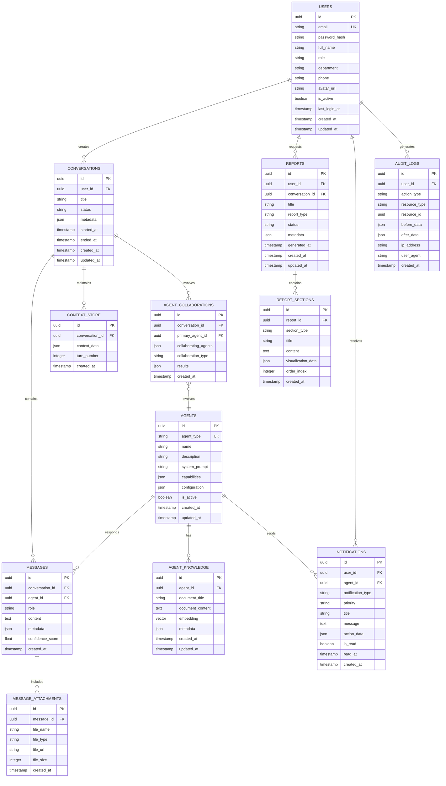

# Database Design (데이터베이스 설계)
## C-Level AI Agent Service - Entity Relationship Diagram

**버전**: v1.0  
**작성일**: 2026-01-10  
**프로젝트**: CEO를 위한 맞춤형 AI 에이전트 서비스

---

## 1. 데이터베이스 설계 개요

본 문서는 C레벨 AI 에이전트 서비스의 핵심 데이터 엔티티와 그 관계를 정의합니다. 설계는 다음 원칙을 따릅니다:

- **정규화**: 3NF (Third Normal Form) 준수로 데이터 중복 최소화
- **확장성**: 사용자 및 에이전트 증가에 대응 가능한 구조
- **보안**: 민감 정보 분리 및 암호화 필드 명시
- **성능**: 자주 조회되는 필드에 인덱스 전략 적용
- **감사**: 모든 주요 엔티티에 생성/수정 타임스탬프 및 사용자 추적

---

## 2. 전체 ERD (Entity Relationship Diagram)



---

## 3. 엔티티 상세 정의

### 3.1 USERS (사용자)

**목적**: CEO 및 C레벨 임원 정보 관리

| 컬럼명 | 타입 | 제약조건 | 설명 |
|--------|------|----------|------|
| id | UUID | PK | 사용자 고유 식별자 |
| email | VARCHAR(255) | UNIQUE, NOT NULL | 로그인 이메일 (소문자 정규화) |
| password_hash | VARCHAR(255) | NOT NULL | bcrypt 해시 (암호화) |
| full_name | VARCHAR(100) | NOT NULL | 사용자 전체 이름 |
| role | VARCHAR(50) | NOT NULL | 역할 (CEO, CFO, CTO, CMO, COO, CHRO, ADMIN) |
| department | VARCHAR(100) | NULL | 소속 부서 |
| phone | VARCHAR(20) | NULL | 연락처 (암호화) |
| avatar_url | TEXT | NULL | 프로필 이미지 URL |
| is_active | BOOLEAN | DEFAULT TRUE | 계정 활성화 상태 |
| last_login_at | TIMESTAMP | NULL | 마지막 로그인 시간 |
| created_at | TIMESTAMP | DEFAULT NOW() | 생성 시간 |
| updated_at | TIMESTAMP | DEFAULT NOW() | 수정 시간 |

**인덱스**:
- `idx_users_email` (email) - 로그인 조회 최적화
- `idx_users_role` (role) - 역할별 필터링

**보안**:
- `password_hash`: bcrypt (cost factor 12)
- `phone`: AES-256 암호화

---

### 3.2 AGENTS (AI 에이전트)

**목적**: C레벨 AI 에이전트 메타데이터 및 설정 관리

| 컬럼명 | 타입 | 제약조건 | 설명 |
|--------|------|----------|------|
| id | UUID | PK | 에이전트 고유 식별자 |
| agent_type | VARCHAR(50) | UNIQUE, NOT NULL | 에이전트 유형 (CFO, CTO, CMO, COO, CHRO) |
| name | VARCHAR(100) | NOT NULL | 에이전트 이름 (예: "재무 담당 AI") |
| description | TEXT | NULL | 에이전트 설명 |
| system_prompt | TEXT | NOT NULL | LLM 시스템 프롬프트 |
| capabilities | JSONB | NOT NULL | 에이전트 능력 목록 |
| configuration | JSONB | NOT NULL | 에이전트 설정 (LLM 모델, 온도 등) |
| is_active | BOOLEAN | DEFAULT TRUE | 에이전트 활성화 상태 |
| created_at | TIMESTAMP | DEFAULT NOW() | 생성 시간 |
| updated_at | TIMESTAMP | DEFAULT NOW() | 수정 시간 |

**인덱스**:
- `idx_agents_type` (agent_type) - 에이전트 조회 최적화

**예시 데이터**:
```json
{
  "agent_type": "CFO",
  "name": "재무 담당 AI (CFO Agent)",
  "capabilities": ["financial_analysis", "budget_forecasting", "cost_optimization"],
  "configuration": {
    "llm_model": "gpt-4-turbo",
    "temperature": 0.3,
    "max_tokens": 2000
  }
}
```

---

### 3.3 CONVERSATIONS (대화 세션)

**목적**: CEO와 에이전트 간의 대화 세션 관리

| 컬럼명 | 타입 | 제약조건 | 설명 |
|--------|------|----------|------|
| id | UUID | PK | 대화 세션 고유 식별자 |
| user_id | UUID | FK (USERS), NOT NULL | 대화 시작 사용자 |
| title | VARCHAR(200) | NOT NULL | 대화 제목 (자동 생성 또는 사용자 지정) |
| status | VARCHAR(50) | DEFAULT 'active' | 상태 (active, archived, deleted) |
| metadata | JSONB | NULL | 추가 메타데이터 (태그, 카테고리 등) |
| started_at | TIMESTAMP | DEFAULT NOW() | 대화 시작 시간 |
| ended_at | TIMESTAMP | NULL | 대화 종료 시간 |
| created_at | TIMESTAMP | DEFAULT NOW() | 생성 시간 |
| updated_at | TIMESTAMP | DEFAULT NOW() | 수정 시간 |

**인덱스**:
- `idx_conversations_user_id` (user_id) - 사용자별 대화 조회
- `idx_conversations_status` (status) - 상태별 필터링
- `idx_conversations_started_at` (started_at DESC) - 최신 대화 조회

---

### 3.4 MESSAGES (메시지)

**목적**: 대화 내 질의 및 응답 메시지 저장

| 컬럼명 | 타입 | 제약조건 | 설명 |
|--------|------|----------|------|
| id | UUID | PK | 메시지 고유 식별자 |
| conversation_id | UUID | FK (CONVERSATIONS), NOT NULL | 소속 대화 세션 |
| agent_id | UUID | FK (AGENTS), NULL | 응답한 에이전트 (사용자 메시지는 NULL) |
| role | VARCHAR(20) | NOT NULL | 역할 (user, assistant, system) |
| content | TEXT | NOT NULL | 메시지 내용 |
| metadata | JSONB | NULL | 추가 정보 (토큰 수, 처리 시간 등) |
| confidence_score | FLOAT | NULL | 응답 신뢰도 (0.0 ~ 1.0) |
| created_at | TIMESTAMP | DEFAULT NOW() | 생성 시간 |

**인덱스**:
- `idx_messages_conversation_id` (conversation_id, created_at) - 대화별 메시지 조회
- `idx_messages_agent_id` (agent_id) - 에이전트별 응답 조회

**예시 데이터**:
```json
{
  "role": "assistant",
  "content": "2024년 4분기 매출은 전년 대비 15% 증가했습니다...",
  "metadata": {
    "tokens_used": 450,
    "processing_time_ms": 2300,
    "llm_model": "gpt-4-turbo"
  },
  "confidence_score": 0.92
}
```

---

### 3.5 MESSAGE_ATTACHMENTS (메시지 첨부파일)

**목적**: 메시지에 첨부된 파일 관리 (차트, 문서 등)

| 컬럼명 | 타입 | 제약조건 | 설명 |
|--------|------|----------|------|
| id | UUID | PK | 첨부파일 고유 식별자 |
| message_id | UUID | FK (MESSAGES), NOT NULL | 소속 메시지 |
| file_name | VARCHAR(255) | NOT NULL | 파일명 |
| file_type | VARCHAR(50) | NOT NULL | 파일 유형 (pdf, xlsx, png, jpg) |
| file_url | TEXT | NOT NULL | 파일 저장 URL (S3 등) |
| file_size | INTEGER | NOT NULL | 파일 크기 (bytes) |
| created_at | TIMESTAMP | DEFAULT NOW() | 생성 시간 |

**인덱스**:
- `idx_attachments_message_id` (message_id) - 메시지별 첨부파일 조회

---

### 3.6 CONTEXT_STORE (컨텍스트 저장소)

**목적**: 대화 컨텍스트 유지 및 참조 표현 해석

| 컬럼명 | 타입 | 제약조건 | 설명 |
|--------|------|----------|------|
| id | UUID | PK | 컨텍스트 고유 식별자 |
| conversation_id | UUID | FK (CONVERSATIONS), NOT NULL | 소속 대화 세션 |
| context_data | JSONB | NOT NULL | 컨텍스트 데이터 (엔티티, 의도 등) |
| turn_number | INTEGER | NOT NULL | 대화 턴 번호 |
| created_at | TIMESTAMP | DEFAULT NOW() | 생성 시간 |

**인덱스**:
- `idx_context_conversation_id` (conversation_id, turn_number DESC) - 최신 컨텍스트 조회

**예시 데이터**:
```json
{
  "context_data": {
    "entities": {
      "time_period": "2024 Q4",
      "department": "Marketing",
      "metric": "ROI"
    },
    "previous_intent": "financial_query",
    "referenced_agents": ["CFO", "CMO"]
  },
  "turn_number": 3
}
```

---

### 3.7 AGENT_COLLABORATIONS (에이전트 협업)

**목적**: 멀티 에이전트 협업 기록 및 결과 추적

| 컬럼명 | 타입 | 제약조건 | 설명 |
|--------|------|----------|------|
| id | UUID | PK | 협업 고유 식별자 |
| conversation_id | UUID | FK (CONVERSATIONS), NOT NULL | 소속 대화 세션 |
| primary_agent_id | UUID | FK (AGENTS), NOT NULL | 주도 에이전트 |
| collaborating_agents | JSONB | NOT NULL | 협업 에이전트 목록 및 역할 |
| collaboration_type | VARCHAR(50) | NOT NULL | 협업 유형 (parallel, sequential, hierarchical) |
| results | JSONB | NOT NULL | 각 에이전트의 응답 및 통합 결과 |
| created_at | TIMESTAMP | DEFAULT NOW() | 생성 시간 |

**인덱스**:
- `idx_collaborations_conversation_id` (conversation_id) - 대화별 협업 조회

**예시 데이터**:
```json
{
  "primary_agent_id": "cfo-agent-uuid",
  "collaborating_agents": [
    {"agent_id": "cmo-agent-uuid", "role": "marketing_data_provider"},
    {"agent_id": "coo-agent-uuid", "role": "operational_cost_analyzer"}
  ],
  "collaboration_type": "parallel",
  "results": {
    "cfo_response": "...",
    "cmo_response": "...",
    "coo_response": "...",
    "integrated_response": "..."
  }
}
```

---

### 3.8 REPORTS (보고서)

**목적**: 생성된 보고서 메타데이터 관리

| 컬럼명 | 타입 | 제약조건 | 설명 |
|--------|------|----------|------|
| id | UUID | PK | 보고서 고유 식별자 |
| user_id | UUID | FK (USERS), NOT NULL | 보고서 요청자 |
| conversation_id | UUID | FK (CONVERSATIONS), NULL | 연관 대화 세션 |
| title | VARCHAR(200) | NOT NULL | 보고서 제목 |
| report_type | VARCHAR(50) | NOT NULL | 보고서 유형 (summary, detailed, comparative) |
| status | VARCHAR(50) | DEFAULT 'draft' | 상태 (draft, final, archived) |
| metadata | JSONB | NULL | 추가 메타데이터 (공유 설정 등) |
| generated_at | TIMESTAMP | DEFAULT NOW() | 생성 시간 |
| created_at | TIMESTAMP | DEFAULT NOW() | 생성 시간 |
| updated_at | TIMESTAMP | DEFAULT NOW() | 수정 시간 |

**인덱스**:
- `idx_reports_user_id` (user_id, generated_at DESC) - 사용자별 최신 보고서 조회
- `idx_reports_type` (report_type) - 유형별 필터링

---

### 3.9 REPORT_SECTIONS (보고서 섹션)

**목적**: 보고서 내 섹션별 콘텐츠 저장

| 컬럼명 | 타입 | 제약조건 | 설명 |
|--------|------|----------|------|
| id | UUID | PK | 섹션 고유 식별자 |
| report_id | UUID | FK (REPORTS), NOT NULL | 소속 보고서 |
| section_type | VARCHAR(50) | NOT NULL | 섹션 유형 (executive_summary, financial_analysis, chart) |
| title | VARCHAR(200) | NOT NULL | 섹션 제목 |
| content | TEXT | NOT NULL | 섹션 내용 (텍스트 또는 HTML) |
| visualization_data | JSONB | NULL | 차트 데이터 (Chart.js 포맷) |
| order_index | INTEGER | NOT NULL | 섹션 순서 |
| created_at | TIMESTAMP | DEFAULT NOW() | 생성 시간 |

**인덱스**:
- `idx_report_sections_report_id` (report_id, order_index) - 보고서별 섹션 순서 조회

---

### 3.10 AGENT_KNOWLEDGE (에이전트 지식 베이스)

**목적**: 에이전트별 전용 지식 베이스 문서 저장 (RAG)

| 컬럼명 | 타입 | 제약조건 | 설명 |
|--------|------|----------|------|
| id | UUID | PK | 지식 문서 고유 식별자 |
| agent_id | UUID | FK (AGENTS), NOT NULL | 소속 에이전트 |
| document_title | VARCHAR(200) | NOT NULL | 문서 제목 |
| document_content | TEXT | NOT NULL | 문서 내용 |
| embedding | VECTOR(1536) | NOT NULL | 텍스트 임베딩 (OpenAI ada-002) |
| metadata | JSONB | NULL | 문서 메타데이터 (출처, 날짜 등) |
| created_at | TIMESTAMP | DEFAULT NOW() | 생성 시간 |
| updated_at | TIMESTAMP | DEFAULT NOW() | 수정 시간 |

**인덱스**:
- `idx_knowledge_agent_id` (agent_id) - 에이전트별 지식 조회
- `idx_knowledge_embedding` (embedding) - 벡터 유사도 검색 (pgvector)

**예시 데이터**:
```json
{
  "agent_id": "cfo-agent-uuid",
  "document_title": "2024년 재무 정책 가이드라인",
  "document_content": "...",
  "metadata": {
    "source": "internal_policy",
    "version": "2.1",
    "last_reviewed": "2024-01-01"
  }
}
```

---

### 3.11 NOTIFICATIONS (알림)

**목적**: 실시간 알림 및 이벤트 관리

| 컬럼명 | 타입 | 제약조건 | 설명 |
|--------|------|----------|------|
| id | UUID | PK | 알림 고유 식별자 |
| user_id | UUID | FK (USERS), NOT NULL | 알림 수신자 |
| agent_id | UUID | FK (AGENTS), NULL | 알림 발송 에이전트 |
| notification_type | VARCHAR(50) | NOT NULL | 알림 유형 (alert, reminder, report_ready) |
| priority | VARCHAR(20) | DEFAULT 'normal' | 우선순위 (urgent, high, normal, low) |
| title | VARCHAR(200) | NOT NULL | 알림 제목 |
| message | TEXT | NOT NULL | 알림 내용 |
| action_data | JSONB | NULL | 액션 데이터 (링크, 버튼 등) |
| is_read | BOOLEAN | DEFAULT FALSE | 읽음 여부 |
| read_at | TIMESTAMP | NULL | 읽은 시간 |
| created_at | TIMESTAMP | DEFAULT NOW() | 생성 시간 |

**인덱스**:
- `idx_notifications_user_id` (user_id, is_read, created_at DESC) - 사용자별 미읽음 알림 조회
- `idx_notifications_priority` (priority) - 우선순위별 필터링

---

### 3.12 AUDIT_LOGS (감사 로그)

**목적**: 모든 주요 액션 감사 추적 (GDPR/ISO 27001 준수)

| 컬럼명 | 타입 | 제약조건 | 설명 |
|--------|------|----------|------|
| id | UUID | PK | 로그 고유 식별자 |
| user_id | UUID | FK (USERS), NULL | 액션 수행자 (시스템 액션은 NULL) |
| action_type | VARCHAR(50) | NOT NULL | 액션 유형 (CREATE, READ, UPDATE, DELETE) |
| resource_type | VARCHAR(50) | NOT NULL | 리소스 유형 (conversation, report, user) |
| resource_id | UUID | NOT NULL | 리소스 식별자 |
| before_data | JSONB | NULL | 변경 전 데이터 (UPDATE/DELETE 시) |
| after_data | JSONB | NULL | 변경 후 데이터 (CREATE/UPDATE 시) |
| ip_address | VARCHAR(45) | NULL | 요청 IP 주소 |
| user_agent | TEXT | NULL | 사용자 에이전트 |
| created_at | TIMESTAMP | DEFAULT NOW() | 생성 시간 |

**인덱스**:
- `idx_audit_logs_user_id` (user_id, created_at DESC) - 사용자별 액션 조회
- `idx_audit_logs_resource` (resource_type, resource_id) - 리소스별 변경 이력 조회
- `idx_audit_logs_created_at` (created_at DESC) - 시간순 조회

---

## 4. 관계 요약

| 관계 | 카디널리티 | 설명 |
|------|------------|------|
| USERS → CONVERSATIONS | 1:N | 한 사용자는 여러 대화 세션 생성 |
| CONVERSATIONS → MESSAGES | 1:N | 한 대화는 여러 메시지 포함 |
| AGENTS → MESSAGES | 1:N | 한 에이전트는 여러 메시지 응답 |
| MESSAGES → MESSAGE_ATTACHMENTS | 1:N | 한 메시지는 여러 첨부파일 포함 |
| CONVERSATIONS → CONTEXT_STORE | 1:N | 한 대화는 여러 컨텍스트 스냅샷 유지 |
| CONVERSATIONS → AGENT_COLLABORATIONS | 1:N | 한 대화는 여러 협업 세션 포함 |
| USERS → REPORTS | 1:N | 한 사용자는 여러 보고서 요청 |
| REPORTS → REPORT_SECTIONS | 1:N | 한 보고서는 여러 섹션 포함 |
| AGENTS → AGENT_KNOWLEDGE | 1:N | 한 에이전트는 여러 지식 문서 보유 |
| USERS → NOTIFICATIONS | 1:N | 한 사용자는 여러 알림 수신 |
| USERS → AUDIT_LOGS | 1:N | 한 사용자는 여러 액션 수행 |

---

## 5. 데이터 보존 및 삭제 정책

| 엔티티 | 보존 기간 | 삭제 정책 |
|--------|-----------|-----------|
| USERS | 계정 삭제 시까지 | 소프트 삭제 (is_active = FALSE), 30일 후 하드 삭제 |
| CONVERSATIONS | 2년 | 자동 아카이브 (status = 'archived'), 5년 후 삭제 |
| MESSAGES | 2년 | 대화 삭제 시 함께 삭제 (CASCADE) |
| REPORTS | 5년 | 사용자 요청 시 즉시 삭제 가능 |
| AGENT_KNOWLEDGE | 영구 | 수동 삭제만 가능 |
| AUDIT_LOGS | 7년 | 법적 요구사항 준수, 자동 삭제 |
| NOTIFICATIONS | 90일 | 읽음 알림 30일 후 자동 삭제, 미읽음 90일 후 삭제 |

---

## 6. 성능 최적화 전략

### 6.1 인덱스 전략
- **복합 인덱스**: 자주 함께 조회되는 컬럼 (예: user_id + created_at)
- **부분 인덱스**: 특정 조건만 인덱싱 (예: is_active = TRUE인 사용자만)
- **벡터 인덱스**: pgvector의 HNSW 인덱스로 유사도 검색 최적화

### 6.2 파티셔닝
- **MESSAGES**: 월별 파티셔닝 (created_at 기준)
- **AUDIT_LOGS**: 분기별 파티셔닝 (created_at 기준)

### 6.3 캐싱
- **Redis 캐싱**: 
  - 사용자 세션 (TTL: 24시간)
  - 자주 조회되는 보고서 (TTL: 15분)
  - 에이전트 설정 (TTL: 1시간)

---

## 7. 보안 고려사항

### 7.1 암호화
- **전송 중**: TLS 1.3
- **저장 시**: 
  - `password_hash`: bcrypt (cost 12)
  - `phone`: AES-256
  - 민감 메시지 내용: 선택적 암호화 (JSONB 필드)

### 7.2 접근 제어
- **Row-Level Security (RLS)**: PostgreSQL RLS로 사용자별 데이터 격리
- **역할 기반 접근**: CEO는 모든 데이터, C-Level은 자신의 데이터만 조회

### 7.3 감사
- **모든 CUD 작업**: AUDIT_LOGS에 자동 기록 (트리거 또는 애플리케이션 레벨)

---

## 8. 확장성 고려사항

### 8.1 수평 확장
- **읽기 복제본**: 보고서 조회 등 읽기 작업 분산
- **샤딩**: 사용자 ID 기반 샤딩 (100만 사용자 이상 시)

### 8.2 데이터 아카이빙
- **콜드 스토리지**: 2년 이상 된 대화는 S3 Glacier로 이동
- **압축**: 오래된 메시지 내용 압축 저장

---

**문서 버전 관리**  
- v1.0 (2026-01-10): 초기 ERD 설계, 12개 핵심 엔티티 정의
- 다음 업데이트: Phase 1 개발 중 실제 데이터 패턴 분석 후 최적화