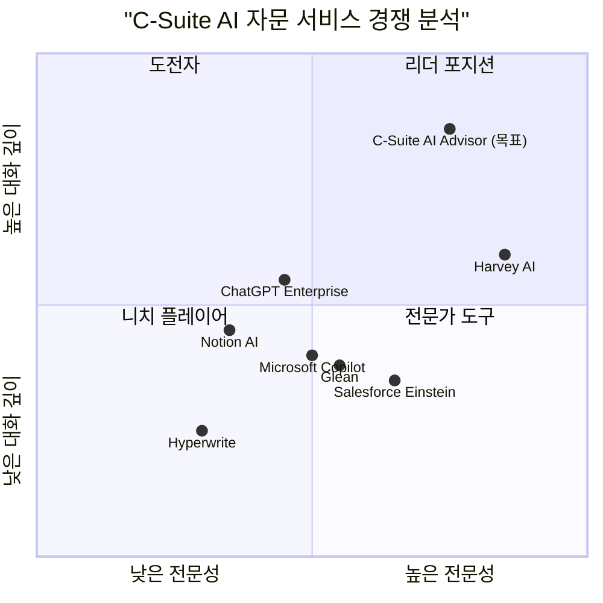

# CEO를 위한 C-Suite AI 에이전트 서비스 PRD

## 프로젝트 정보

**프로젝트명**: c_suite_ai_advisor  
**버전**: 1.0  
**작성일**: 2026-01-10  
**기술 스택**: Shadcn-ui, TypeScript, Tailwind CSS  
**문서 언어**: 한국어

## 원본 요구사항

CEO들을 위한 맞춤형 AI 서비스 앱으로, MGX와 유사하게 C레벨 임원들(CFO, CTO, CMO, COO 등)을 AI 에이전트화하여, CEO가 질문하면 해당 업무를 분석하여 적절한 에이전트가 호출되어 보고하는 시스템입니다. 소크라테스식 대화법을 참고하여 질문을 통한 통찰 도출 방식을 적용합니다.

---

## 1. 문제 정의 및 배경

### 1.1 현재 상황

현대 기업의 CEO들은 다음과 같은 과제에 직면해 있습니다:

- **정보 과부하**: 재무, 기술, 마케팅, 운영, 인사 등 다양한 영역의 정보를 실시간으로 파악해야 함
- **의사결정 속도**: 빠르게 변화하는 시장 환경에서 신속한 의사결정이 필요
- **전문성 격차**: 모든 영역에 대한 깊은 전문 지식을 갖추기 어려움
- **커뮤니케이션 비용**: C레벨 임원들과의 회의 조율 및 보고서 작성에 많은 시간 소요
- **통찰력 부족**: 단순 데이터 제공이 아닌, 전략적 질문을 통한 깊이 있는 분석 필요

### 1.2 시장 기회

- AI 에이전트 기술의 성숙도 증가
- 경영진의 AI 도구 활용 의지 증대
- 원격 근무 및 비동기 커뮤니케이션 트렌드
- 소크라테스식 질문법을 통한 사고 확장 수요

### 1.3 해결하고자 하는 문제

CEO가 언제든지 각 영역의 전문가(C레벨 임원)에게 질문하고, 소크라테스식 대화법을 통해 깊이 있는 통찰을 얻을 수 있는 AI 기반 자문 시스템의 부재

---

## 2. 제품 정의

### 2.1 제품 목표 (Product Goals)

1. **즉각적인 전문가 자문 제공**: CEO가 24/7 언제든지 각 영역의 C레벨 AI 에이전트로부터 전문적인 조언을 받을 수 있도록 함
2. **소크라테스식 통찰 도출**: 단순 답변이 아닌, 질문을 통해 CEO 스스로 더 깊은 통찰을 얻을 수 있도록 지원
3. **지능형 업무 라우팅**: CEO의 질의를 자동으로 분석하여 가장 적합한 C레벨 에이전트(또는 복수 에이전트)에게 연결

### 2.2 사용자 스토리 (User Stories)

1. **전략적 의사결정 지원**  
   As a CEO, I want to ask strategic questions about our market position so that I can make informed decisions quickly without waiting for executive meetings.

2. **재무 건전성 점검**  
   As a CEO, I want to inquire about our financial health and get CFO-level insights so that I can understand cash flow, profitability, and investment opportunities.

3. **기술 전략 검토**  
   As a CEO, I want to discuss technology roadmap and digital transformation initiatives so that I can align tech strategy with business goals.

4. **마케팅 효과 분석**  
   As a CEO, I want to evaluate marketing campaign performance and brand positioning so that I can optimize our market presence.

5. **조직 문화 및 인재 관리**  
   As a CEO, I want to get insights on employee engagement and talent acquisition so that I can build a strong organizational culture.

### 2.3 경쟁사 분석 (Competitive Analysis)

| 제품명 | 장점 | 단점 |
|--------|------|------|
| **ChatGPT Enterprise** | - 범용 AI 어시스턴트<br>- 강력한 자연어 처리<br>- 다양한 업무 지원 | - 특화된 C레벨 페르소나 부재<br>- 맥락 유지 제한적<br>- 기업 데이터 통합 약함 |
| **Microsoft Copilot** | - Office 생태계 통합<br>- 기업 데이터 접근<br>- 보안성 우수 | - 경영진 특화 기능 부족<br>- 대화형 자문보다는 작업 자동화 중심 |
| **Salesforce Einstein** | - CRM 데이터 활용<br>- 영업/마케팅 인사이트<br>- 예측 분석 | - 영업/마케팅에 한정<br>- 전사적 경영 자문 부족<br>- 복잡한 설정 |
| **Notion AI** | - 문서 기반 협업<br>- 지식 관리 우수<br>- 사용 편의성 | - 능동적 자문 기능 없음<br>- C레벨 페르소나 없음<br>- 분석 기능 제한적 |
| **Glean** | - 기업 검색 및 지식 발견<br>- 다양한 도구 통합<br>- 개인화된 결과 | - 질의응답 중심<br>- 전략적 대화 기능 부족<br>- 소크라테스식 접근 없음 |
| **Harvey AI** | - 법률 전문 AI<br>- 깊이 있는 도메인 지식<br>- 전문가 수준 분석 | - 법률 분야에 한정<br>- 다영역 통합 불가<br>- 경영 전반 커버 안 함 |
| **Hyperwrite/OthersideAI** | - 글쓰기 자동화<br>- 이메일/문서 생성<br>- 시간 절약 | - 단순 작성 도구<br>- 전략적 사고 지원 부족<br>- 에이전트 개념 없음 |

### 2.4 경쟁 포지셔닝 차트 (Competitive Quadrant Chart)



**차별화 포인트**:
- 높은 대화 깊이: 소크라테스식 질문법을 통한 통찰 도출
- 높은 전문성: C레벨 특화 에이전트 페르소나
- 멀티 에이전트 협업: 복합적 질의에 대한 통합 답변

---

## 3. 사용자 페르소나

### 3.1 주 사용자: CEO

**이름**: 김성공 (50세)  
**직책**: CEO, 중견 제조업체  
**배경**:
- 20년 경력의 경영자
- 기술 변화에 적응하려 노력하는 전통적 리더
- 하루 평균 8-10시간 근무, 회의가 업무의 60% 차지

**니즈**:
- 빠른 의사결정을 위한 즉각적인 정보 접근
- 각 영역 전문가의 관점을 종합한 통찰
- 전략적 질문을 통한 사고 확장
- 언제 어디서나 접근 가능한 자문 시스템

**페인 포인트**:
- 임원 회의 일정 조율의 어려움
- 보고서 작성 및 검토에 소요되는 시간
- 긴급 상황 시 즉각적인 전문가 조언 부재
- 복잡한 문제에 대한 다각도 분석 필요

**기대 결과**:
- 의사결정 시간 50% 단축
- 전략적 통찰력 향상
- 임원진과의 효율적 커뮤니케이션

### 3.2 부 사용자: C레벨 임원

**프로필**: 실제 C레벨 임원들이 AI 에이전트의 지식 베이스를 구축하고 검증하는 역할

**니즈**:
- 자신의 전문 지식을 AI 에이전트에 반영
- CEO에게 일관된 메시지 전달
- 반복적인 질문에 대한 자동 응답

---

## 4. C레벨 에이전트 페르소나

### 4.1 CFO 에이전트 (Chief Financial Officer)

**이름**: Alex (CFO Agent)  
**전문 영역**:
- 재무 계획 및 분석 (FP&A)
- 현금 흐름 관리
- 투자 및 자금 조달
- 재무 리스크 관리
- 예산 편성 및 통제

**대화 스타일**:
- 데이터 기반 논리적 접근
- 재무 지표를 활용한 명확한 설명
- 리스크와 기회의 균형 제시

**소크라테스식 질문 예시**:
- "이 투자의 ROI를 어떻게 측정하실 계획이신가요?"
- "현재 현금 흐름 상황에서 이 결정이 미칠 영향을 고려하셨나요?"
- "재무 목표와 이 전략이 어떻게 정렬되나요?"

### 4.2 CTO 에이전트 (Chief Technology Officer)

**이름**: Taylor (CTO Agent)  
**전문 영역**:
- 기술 전략 및 로드맵
- 디지털 전환
- IT 인프라 및 보안
- 제품 개발 및 혁신
- 기술 트렌드 분석

**대화 스타일**:
- 미래 지향적 시각
- 기술과 비즈니스의 연결
- 혁신과 안정성의 균형

**소크라테스식 질문 예시**:
- "이 기술이 우리의 핵심 경쟁력을 어떻게 강화할까요?"
- "현재 기술 스택으로 향후 3년간의 성장을 지원할 수 있을까요?"
- "보안과 혁신 속도 사이에서 어떤 균형을 추구하시나요?"

### 4.3 CMO 에이전트 (Chief Marketing Officer)

**이름**: Morgan (CMO Agent)  
**전문 영역**:
- 브랜드 전략 및 포지셔닝
- 마케팅 캠페인 기획 및 실행
- 고객 인사이트 및 세그먼트
- 디지털 마케팅 및 성과 분석
- 시장 조사 및 경쟁 분석

**대화 스타일**:
- 고객 중심적 사고
- 창의적이면서도 데이터 기반
- 브랜드 가치와 비즈니스 성과 연결

**소크라테스식 질문 예시**:
- "우리의 타겟 고객이 진정으로 원하는 것은 무엇일까요?"
- "이 캠페인이 브랜드 인지도뿐만 아니라 매출에도 기여할까요?"
- "경쟁사 대비 우리의 차별화 포인트가 명확한가요?"

### 4.4 COO 에이전트 (Chief Operating Officer)

**이름**: Jordan (COO Agent)  
**전문 영역**:
- 운영 효율성 및 프로세스 최적화
- 공급망 관리
- 품질 관리
- 생산성 향상
- 비용 절감 전략

**대화 스타일**:
- 실행 중심적
- 프로세스 및 시스템 사고
- 효율성과 품질의 균형

**소크라테스식 질문 예시**:
- "현재 운영 프로세스에서 가장 큰 병목 지점은 어디인가요?"
- "이 변화가 전체 공급망에 미칠 영향을 평가하셨나요?"
- "단기 비용 절감이 장기 품질에 영향을 주지 않을까요?"

### 4.5 CHRO 에이전트 (Chief Human Resources Officer)

**이름**: Riley (CHRO Agent)  
**전문 영역**:
- 인재 채용 및 유지
- 조직 문화 및 가치
- 직원 참여도 및 만족도
- 리더십 개발
- 성과 관리 및 보상

**대화 스타일**:
- 사람 중심적
- 조직 문화와 비즈니스 성과 연결
- 장기적 인재 전략 강조

**소크라테스식 질문 예시**:
- "우리 조직의 핵심 가치가 일상 업무에 어떻게 반영되고 있나요?"
- "최고의 인재를 유지하기 위해 무엇이 필요할까요?"
- "현재 리더십 파이프라인이 미래 성장을 지원할 수 있나요?"

### 4.6 에이전트 협업 시나리오

복합적인 질의의 경우, 여러 에이전트가 협업하여 답변:

**예시**: "신제품 출시 전략을 검토하고 싶습니다."
- **CMO**: 시장 수요 및 포지셔닝 분석
- **CFO**: 투자 비용 및 예상 수익성 평가
- **CTO**: 기술적 실현 가능성 및 개발 일정
- **COO**: 생산 능력 및 공급망 준비도
- **통합 보고서**: 각 관점을 종합한 전략적 권고안

---

## 5. 요구사항 분석 (Requirements Analysis)

### 5.1 핵심 기능 요구사항

#### 5.1.1 지능형 질의 분석 및 라우팅

**설명**: CEO의 자연어 질문을 분석하여 적절한 C레벨 에이전트(단일 또는 복수)에게 자동 라우팅

**기술 요구사항**:
- NLP 기반 의도 분류 (Intent Classification)
- 도메인 식별 (재무, 기술, 마케팅, 운영, 인사)
- 복합 질의 감지 및 분해
- 우선순위 기반 에이전트 선택

**예시**:
- "우리 회사의 현금 흐름이 걱정됩니다" → CFO 에이전트
- "신기술 도입이 매출에 미칠 영향은?" → CTO + CFO + CMO 협업

#### 5.1.2 소크라테스식 대화 엔진

**설명**: 단순 답변이 아닌, 반문과 질문을 통해 CEO의 사고를 확장하고 더 깊은 통찰을 도출

**대화 구조** (소크라테스식 대화법 참고):
1. **명확화 단계**: 질문의 의도와 맥락 파악
   - "구체적으로 어떤 측면이 우려되시나요?"
   - "이 결정의 시간 프레임은 어떻게 되나요?"

2. **가정 탐색 단계**: 숨겨진 가정 드러내기
   - "이 전략이 성공하려면 어떤 조건이 필요할까요?"
   - "현재 가정하고 계신 시장 상황은 무엇인가요?"

3. **증거 및 근거 단계**: 데이터 기반 분석 제공
   - "과거 유사 사례에서는 이런 결과가 나왔습니다"
   - "현재 데이터는 이런 트렌드를 보여줍니다"

4. **대안 탐색 단계**: 다양한 관점 제시
   - "다른 접근 방식을 고려해보셨나요?"
   - "리스크를 줄이면서 같은 목표를 달성할 방법은?"

5. **결론 및 행동 단계**: 실행 가능한 권고안 제시
   - "이러한 분석을 바탕으로 다음 단계를 제안합니다"
   - "의사결정을 위해 추가로 필요한 정보는 무엇인가요?"

**기술 구현**:
- 대화 상태 관리 (Conversation State Machine)
- 맥락 유지 (Context Window Management)
- 질문 생성 모델 (Question Generation)
- 답변 품질 평가 (Response Quality Assessment)

#### 5.1.3 멀티 에이전트 협업 시스템

**설명**: 복합적인 질의에 대해 여러 C레벨 에이전트가 협업하여 통합된 답변 제공

**협업 프로세스**:
1. 질의 분해 및 각 에이전트에게 하위 질문 할당
2. 각 에이전트의 독립적 분석 수행
3. 에이전트 간 정보 공유 및 조율
4. 통합 보고서 생성 (각 관점 + 종합 의견)

**기술 요구사항**:
- 에이전트 간 통신 프로토콜
- 작업 오케스트레이션 (Task Orchestration)
- 응답 통합 및 일관성 유지
- 우선순위 및 의견 충돌 해결

#### 5.1.4 개인화 및 학습 시스템

**설명**: CEO의 질문 패턴, 선호도, 의사결정 스타일을 학습하여 점점 더 맞춤화된 자문 제공

**학습 요소**:
- 자주 묻는 질문 유형
- 선호하는 답변 스타일 (간결함 vs 상세함)
- 의사결정 우선순위 (수익성, 혁신, 안정성 등)
- 과거 결정 및 결과 추적

**기술 구현**:
- 사용자 프로필 구축
- 피드백 루프 (답변 만족도 평가)
- 추천 시스템 (Recommendation Engine)
- A/B 테스트를 통한 지속적 개선

#### 5.1.5 보고서 생성 및 시각화

**설명**: 대화 내용을 구조화된 보고서로 자동 변환, 시각화 자료 포함

**보고서 유형**:
- 일일 경영 대시보드
- 주간/월간 종합 분석 리포트
- 특정 이슈에 대한 심층 분석 보고서
- 의사결정 지원 문서 (Decision Memo)

**시각화 요소**:
- 재무 차트 (손익, 현금흐름, 예산 대비 실적)
- KPI 대시보드
- 트렌드 분석 그래프
- 경쟁 포지셔닝 맵

#### 5.1.6 기업 데이터 통합

**설명**: 실제 기업 데이터(ERP, CRM, HRM 등)와 연동하여 실시간 정보 기반 자문 제공

**통합 대상**:
- 재무 시스템 (ERP, 회계 소프트웨어)
- 고객 관계 관리 (CRM)
- 인사 관리 시스템 (HRM)
- 프로젝트 관리 도구
- 비즈니스 인텔리전스 (BI) 플랫폼

**보안 요구사항**:
- 데이터 암호화 (전송 및 저장)
- 역할 기반 접근 제어 (RBAC)
- 감사 로그 (Audit Trail)
- 규정 준수 (GDPR, SOC 2 등)

#### 5.1.7 모바일 접근성

**설명**: CEO가 언제 어디서나 접근할 수 있도록 모바일 최적화

**기능**:
- 음성 입력 및 음성 답변
- 푸시 알림 (중요 인사이트, 긴급 이슈)
- 오프라인 모드 (최근 대화 캐싱)
- 간편한 UI/UX (한 손 조작 가능)

### 5.2 비기능 요구사항

#### 5.2.1 성능
- 질의 응답 시간: 평균 3초 이내
- 복합 질의 (멀티 에이전트): 10초 이내
- 동시 사용자 지원: 최소 1,000명
- 시스템 가용성: 99.9% 이상

#### 5.2.2 보안
- 엔드투엔드 암호화
- 다단계 인증 (MFA)
- 정기적인 보안 감사
- 데이터 백업 및 재해 복구

#### 5.2.3 확장성
- 수평적 확장 가능한 아키텍처
- 클라우드 네이티브 설계
- 마이크로서비스 기반
- 에이전트 추가 용이성 (플러그인 방식)

#### 5.2.4 사용성
- 직관적인 대화형 인터페이스
- 최소한의 학습 곡선
- 다국어 지원 (한국어, 영어 우선)
- 접근성 표준 준수 (WCAG)

---

## 6. 요구사항 풀 (Requirements Pool)

### P0 (Must-Have) - MVP 필수 기능

| ID | 요구사항 | 설명 | 담당 에이전트 |
|----|----------|------|---------------|
| P0-1 | 기본 질의응답 시스템 | CEO가 자연어로 질문하고 답변 받기 | CFO, CTO, CMO |
| P0-2 | 3개 핵심 에이전트 구현 | CFO, CTO, CMO 에이전트 | 해당 에이전트 |
| P0-3 | 단일 에이전트 라우팅 | 질문을 분석하여 적절한 1개 에이전트 선택 | 시스템 |
| P0-4 | 소크라테스식 기본 대화 | 명확화 + 증거 제시 + 권고안 (3단계) | 모든 에이전트 |
| P0-5 | 대화 히스토리 저장 | 과거 대화 내용 조회 가능 | 시스템 |
| P0-6 | 웹 인터페이스 | 데스크톱 브라우저 기반 UI | 프론트엔드 |
| P0-7 | 사용자 인증 | 로그인 및 세션 관리 | 시스템 |
| P0-8 | 기본 보안 | HTTPS, 데이터 암호화 | 인프라 |

### P1 (Should-Have) - 중요하지만 MVP 이후 가능

| ID | 요구사항 | 설명 | 담당 에이전트 |
|----|----------|------|---------------|
| P1-1 | 멀티 에이전트 협업 | 복합 질의에 대한 여러 에이전트 동시 답변 | 시스템 |
| P1-2 | COO, CHRO 에이전트 추가 | 운영 및 인사 영역 커버 | 해당 에이전트 |
| P1-3 | 소크라테스식 전체 5단계 | 가정 탐색, 대안 탐색 단계 추가 | 모든 에이전트 |
| P1-4 | 보고서 자동 생성 | 대화 내용을 PDF/PPT 보고서로 변환 | 시스템 |
| P1-5 | 기본 시각화 | 차트 및 그래프 생성 | 시스템 |
| P1-6 | 모바일 웹 최적화 | 반응형 디자인 | 프론트엔드 |
| P1-7 | 기업 데이터 통합 (1개) | ERP 또는 CRM 중 1개 시스템 연동 | 백엔드 |
| P1-8 | 피드백 시스템 | 답변 만족도 평가 | 시스템 |

### P2 (Nice-to-Have) - 향후 고려 사항

| ID | 요구사항 | 설명 | 담당 에이전트 |
|----|----------|------|---------------|
| P2-1 | 음성 인터페이스 | 음성 입력 및 음성 답변 | 프론트엔드 |
| P2-2 | 네이티브 모바일 앱 | iOS/Android 앱 | 모바일 팀 |
| P2-3 | 고급 개인화 | AI 기반 사용자 선호도 학습 | AI/ML 팀 |
| P2-4 | 예측 분석 | 미래 트렌드 예측 및 시나리오 분석 | AI/ML 팀 |
| P2-5 | 다국어 지원 확대 | 영어, 중국어, 일본어 등 | 시스템 |
| P2-6 | 화이트라벨 솔루션 | 기업별 커스터마이징 가능 | 비즈니스 |
| P2-7 | API 제공 | 외부 시스템 통합용 API | 백엔드 |
| P2-8 | 실시간 알림 | 중요 이슈 발생 시 프로액티브 알림 | 시스템 |

---

## 7. UI 설계 초안 (UI Design Draft)

### 7.1 메인 대시보드

```
+----------------------------------------------------------+
|  [로고] C-Suite AI Advisor              [CEO 이름] [설정] |
+----------------------------------------------------------+
|                                                          |
|  안녕하세요, CEO님! 오늘은 어떤 도움이 필요하신가요?      |
|                                                          |
|  +----------------------------------------------------+  |
|  | 💬 질문을 입력하세요...                   [전송]  |  |
|  +----------------------------------------------------+  |
|                                                          |
|  빠른 질문:                                              |
|  [💰 재무 현황]  [🚀 기술 전략]  [📊 마케팅 성과]       |
|                                                          |
|  최근 대화:                                              |
|  📝 신제품 출시 전략 검토 (2시간 전)                     |
|  📝 Q4 재무 실적 분석 (어제)                             |
|  📝 조직 문화 개선 방안 (3일 전)                         |
|                                                          |
+----------------------------------------------------------+
```

### 7.2 대화 화면

```
+----------------------------------------------------------+
|  ← 대시보드                                  [보고서 생성] |
+----------------------------------------------------------+
|                                                          |
|  [CEO 아바타]                                            |
|  우리 회사의 현금 흐름이 걱정됩니다. 어떻게 해야 할까요?  |
|                                                          |
|                                            [CFO 아바타]  |
|                  CEO님, 구체적으로 어떤 측면이 우려되시나요? |
|                  - 단기 유동성 문제인가요?                |
|                  - 장기 투자 계획과의 충돌인가요?         |
|                  - 아니면 예상치 못한 지출이 발생했나요?   |
|                                                          |
|  [CEO 아바타]                                            |
|  다음 분기 대규모 설비 투자가 예정되어 있는데,            |
|  현재 매출 회수가 지연되고 있습니다.                      |
|                                                          |
|                                            [CFO 아바타]  |
|                  이해했습니다. 현재 상황을 분석해보겠습니다. |
|                                                          |
|                  📊 현금 흐름 분석 (최근 3개월)           |
|                  [차트 표시]                              |
|                                                          |
|                  현재 현금 잔고: 50억원                   |
|                  예정 설비 투자: 80억원                   |
|                  미수금: 40억원 (평균 회수 기간 60일)     |
|                                                          |
|                  몇 가지 질문을 드리겠습니다:              |
|                  1. 설비 투자 시기를 조정할 수 있나요?    |
|                  2. 단기 자금 조달 옵션을 고려하셨나요?   |
|                  3. 미수금 회수를 앞당길 방법은?          |
|                                                          |
|  +----------------------------------------------------+  |
|  | 💬 답변 입력...                           [전송]  |  |
|  +----------------------------------------------------+  |
|                                                          |
+----------------------------------------------------------+
```

### 7.3 멀티 에이전트 협업 화면

```
+----------------------------------------------------------+
|  ← 대시보드                    [통합 보고서] [각 에이전트] |
+----------------------------------------------------------+
|                                                          |
|  질문: 신제품 출시 전략을 검토하고 싶습니다.              |
|                                                          |
|  [협업 중] CFO, CTO, CMO, COO가 분석 중입니다...         |
|                                                          |
|  +------------------------------------------------------+|
|  | 📊 CMO (마케팅 관점)                           [완료] ||
|  | 시장 수요 분석 결과, 타겟 고객층의 70%가...          ||
|  | [자세히 보기]                                         ||
|  +------------------------------------------------------+|
|                                                          |
|  +------------------------------------------------------+|
|  | 💰 CFO (재무 관점)                             [완료] ||
|  | 예상 투자 비용: 30억원, ROI: 18개월 내 회수 가능...  ||
|  | [자세히 보기]                                         ||
|  +------------------------------------------------------+|
|                                                          |
|  +------------------------------------------------------+|
|  | 🚀 CTO (기술 관점)                         [진행 중] ||
|  | 기술적 실현 가능성 검토 중...                         ||
|  +------------------------------------------------------+|
|                                                          |
|  +------------------------------------------------------+|
|  | ⚙️ COO (운영 관점)                             [대기] ||
|  +------------------------------------------------------+|
|                                                          |
|  [통합 보고서 생성 대기 중...]                           |
|                                                          |
+----------------------------------------------------------+
```

### 7.4 보고서 화면

```
+----------------------------------------------------------+
|  ← 대화로 돌아가기                [PDF 다운로드] [공유]   |
+----------------------------------------------------------+
|                                                          |
|  📄 신제품 출시 전략 종합 분석 보고서                    |
|  생성일: 2026-01-10  |  참여 에이전트: CFO, CTO, CMO, COO |
|                                                          |
|  ## 요약 (Executive Summary)                             |
|  - 시장 기회: 높음 (성장률 25%)                          |
|  - 재무 타당성: 양호 (ROI 18개월)                        |
|  - 기술 준비도: 중간 (6개월 개발 필요)                   |
|  - 운영 실행 가능성: 높음                                |
|  - 종합 권고: 진행 추천 (조건부)                         |
|                                                          |
|  ## 1. 마케팅 분석 (CMO)                                 |
|  [차트: 시장 규모 및 성장률]                             |
|  ...                                                     |
|                                                          |
|  ## 2. 재무 분석 (CFO)                                   |
|  [표: 투자 비용 및 예상 수익]                            |
|  ...                                                     |
|                                                          |
|  ## 3. 기술 분석 (CTO)                                   |
|  ...                                                     |
|                                                          |
|  ## 4. 운영 분석 (COO)                                   |
|  ...                                                     |
|                                                          |
|  ## 5. 종합 권고안                                       |
|  다음 단계:                                              |
|  1. 시장 테스트 (3개월)                                  |
|  2. 기술 개발 착수 (즉시)                                |
|  3. 운영 준비 (2개월)                                    |
|                                                          |
+----------------------------------------------------------+
```

---

## 8. 성공 지표 (Success Metrics)

### 8.1 노스스타 지표 (North Star Metric)

**CEO 의사결정 시간 단축률**
- 정의: AI 자문 도입 전후 주요 의사결정에 소요되는 시간 비교
- 목표: 50% 단축
- 측정 방법: 사용자 설문 + 대화 로그 분석

### 8.2 입력 지표 (Input Metrics)

#### 8.2.1 사용자 참여도
- **일일 활성 사용자 (DAU)**: 목표 CEO의 80% 이상
- **주간 활성 사용자 (WAU)**: 목표 CEO의 95% 이상
- **평균 세션 길이**: 15분 이상
- **일일 평균 질의 수**: CEO당 5-10개

#### 8.2.2 시스템 성능
- **평균 응답 시간**: 3초 이내
- **에이전트 라우팅 정확도**: 90% 이상
- **시스템 가용성**: 99.9%
- **오류율**: 1% 미만

#### 8.2.3 답변 품질
- **답변 만족도**: 평균 4.5/5.0 이상
- **재질문률**: 20% 이하 (명확한 답변 비율)
- **보고서 활용률**: 생성된 보고서의 70% 이상 실제 사용

#### 8.2.4 비즈니스 임팩트
- **의사결정 자신감**: 설문 점수 4.0/5.0 이상
- **임원 회의 시간 감소**: 30% 이상
- **전략적 이니셔티브 증가**: 분기당 20% 증가

### 8.3 출력 지표 (Output Metrics)

#### 8.3.1 단기 (3개월)
- 100명 이상의 CEO 사용자 확보
- 10,000건 이상의 질의응답 처리
- 평균 사용자 만족도 4.0/5.0 달성

#### 8.3.2 중기 (6개월)
- 500명 이상의 CEO 사용자 확보
- 에이전트 라우팅 정확도 95% 달성
- 기업 데이터 통합 완료 (3개 이상 시스템)

#### 8.3.3 장기 (12개월)
- 1,000명 이상의 CEO 사용자 확보
- 의사결정 시간 50% 단축 검증
- 유료 전환율 30% 달성

---

## 9. MVP 범위 및 비범위 (Scope & Non-Goals)

### 9.1 MVP 범위 (In Scope)

#### Phase 1: 기본 시스템 (1-2개월)
1. **핵심 인프라**
   - 웹 기반 대화형 인터페이스
   - 사용자 인증 및 세션 관리
   - 데이터베이스 설계 (대화 히스토리, 사용자 프로필)

2. **3개 핵심 에이전트**
   - CFO 에이전트: 재무 분석 및 자문
   - CTO 에이전트: 기술 전략 자문
   - CMO 에이전트: 마케팅 전략 자문

3. **기본 AI 기능**
   - 자연어 질의 처리
   - 단일 에이전트 라우팅
   - 소크라테스식 대화 (3단계: 명확화, 증거, 권고)

4. **기본 UI/UX**
   - 대시보드
   - 대화 화면
   - 히스토리 조회

#### Phase 2: 고도화 (3-4개월)
1. **멀티 에이전트 협업**
   - 복합 질의 처리
   - 에이전트 간 조율
   - 통합 보고서 생성

2. **추가 에이전트**
   - COO 에이전트
   - CHRO 에이전트

3. **소크라테스식 대화 확장**
   - 5단계 전체 구현
   - 맥락 기반 질문 생성

4. **보고서 기능**
   - PDF/PPT 자동 생성
   - 기본 시각화 (차트, 그래프)

### 9.2 MVP 비범위 (Out of Scope / Non-Goals)

#### 단기적으로 제외
1. **네이티브 모바일 앱**: 웹 반응형으로 대체
2. **음성 인터페이스**: 텍스트 기반으로 시작
3. **실시간 데이터 통합**: 수동 데이터 입력 또는 배치 처리
4. **고급 예측 분석**: 기본 트렌드 분석만 제공
5. **다국어 지원**: 한국어와 영어만 지원

#### 장기적으로 고려
1. **화이트라벨 솔루션**: 초기에는 단일 제품으로 출시
2. **API 제공**: 내부 사용에만 집중
3. **커스텀 에이전트 생성**: 표준 C레벨 에이전트만 제공
4. **블록체인 기반 보안**: 전통적 보안 방식 사용
5. **AR/VR 인터페이스**: 웹/모바일에 집중

#### 명시적 비목표 (Explicit Non-Goals)
1. **일반 직원용 도구**: CEO 및 C레벨에만 집중
2. **프로젝트 관리 기능**: 자문에만 집중, 실행 도구 아님
3. **협업 플랫폼**: 1:1 자문 중심, 팀 협업 기능 없음
4. **문서 저장소**: 보고서 생성만, 문서 관리 시스템 아님

---

## 10. 가정과 리스크 (Assumptions & Risks)

### 10.1 주요 가정 (Key Assumptions)

#### 10.1.1 사용자 관련
- CEO들이 AI 도구 사용에 개방적이다
- CEO들이 텍스트 기반 대화형 인터페이스에 익숙하다
- CEO들이 일일 15-30분을 AI 자문에 할애할 의향이 있다
- CEO들이 소크라테스식 질문법에 긍정적으로 반응한다

#### 10.1.2 기술 관련
- 현재 LLM 기술로 C레벨 수준의 자문 제공이 가능하다
- 에이전트 라우팅 정확도 90% 이상 달성 가능하다
- 평균 3초 이내 응답 시간 구현 가능하다
- 기업 데이터 통합이 기술적으로 실현 가능하다

#### 10.1.3 비즈니스 관련
- CEO들이 월 구독료를 지불할 의향이 있다 (예상: $500-1,000/월)
- 기업 데이터 보안 우려를 해소할 수 있다
- 초기 100명의 얼리어답터 확보 가능하다
- 12개월 내 손익분기점 달성 가능하다

### 10.2 주요 리스크 (Key Risks)

#### 10.2.1 제품 리스크

| 리스크 | 영향도 | 발생 가능성 | 완화 전략 |
|--------|--------|-------------|-----------|
| AI 답변 품질 부족 | 높음 | 중간 | - 도메인 전문가와 협업하여 에이전트 훈련<br>- 지속적인 피드백 루프 구축<br>- 인간 검토자(Human-in-the-loop) 도입 |
| 에이전트 라우팅 오류 | 중간 | 중간 | - 다양한 질의 패턴으로 테스트<br>- 사용자가 에이전트 수동 선택 가능하도록<br>- 라우팅 로직 지속 개선 |
| 응답 시간 지연 | 중간 | 낮음 | - 캐싱 전략 구현<br>- 인프라 확장성 확보<br>- 비동기 처리 최적화 |
| 소크라테스식 대화가 번거롭게 느껴짐 | 높음 | 중간 | - 사용자 선호도에 따라 대화 깊이 조절<br>- "빠른 답변" 모드 제공<br>- A/B 테스트로 최적 균형 찾기 |

#### 10.2.2 비즈니스 리스크

| 리스크 | 영향도 | 발생 가능성 | 완화 전략 |
|--------|--------|-------------|-----------|
| 사용자 확보 어려움 | 높음 | 중간 | - 타겟 마케팅 (CEO 네트워크, 컨퍼런스)<br>- 프리미엄 모델 (30일 무료 체험)<br>- 레퍼런스 고객 확보 |
| 데이터 보안 우려 | 높음 | 높음 | - SOC 2, ISO 27001 인증 취득<br>- 온프레미스 배포 옵션 제공<br>- 투명한 데이터 정책 공개 |
| 경쟁사 출현 | 중간 | 높음 | - 빠른 MVP 출시로 선점 효과<br>- 차별화된 소크라테스식 접근법<br>- 고객 록인 (데이터 축적) |
| 수익화 어려움 | 높음 | 중간 | - 다양한 가격 모델 테스트<br>- 기업 라이선스 모델 개발<br>- ROI 명확히 입증 |

#### 10.2.3 기술 리스크

| 리스크 | 영향도 | 발생 가능성 | 완화 전략 |
|--------|--------|-------------|-----------|
| LLM API 비용 급증 | 중간 | 중간 | - 비용 모니터링 및 알림<br>- 캐싱으로 중복 요청 감소<br>- 여러 LLM 제공자 활용 |
| 기업 시스템 통합 복잡도 | 높음 | 높음 | - 표준 API 우선 지원<br>- 전문 통합 파트너 협력<br>- 단계적 통합 접근 |
| 확장성 문제 | 중간 | 낮음 | - 클라우드 네이티브 아키텍처<br>- 로드 테스트 정기 실시<br>- 자동 스케일링 구현 |
| 데이터 프라이버시 규제 | 높음 | 중간 | - 법률 자문 확보<br>- GDPR, CCPA 등 준수<br>- 지역별 데이터 저장 |

#### 10.2.4 조직 리스크

| 리스크 | 영향도 | 발생 가능성 | 완화 전략 |
|--------|--------|-------------|-----------|
| 핵심 인재 확보 어려움 | 높음 | 중간 | - 경쟁력 있는 보상 패키지<br>- 원격 근무 허용<br>- 비전 공유 및 문화 구축 |
| 도메인 전문가 부족 | 중간 | 높음 | - C레벨 어드바이저 보드 구성<br>- 파트타임 전문가 활용<br>- 외부 컨설턴트 협력 |
| 개발 일정 지연 | 중간 | 높음 | - 애자일 방법론 적용<br>- MVP 범위 엄격히 관리<br>- 정기적인 마일스톤 리뷰 |

### 10.3 리스크 완화 우선순위

**최우선 (High Priority)**:
1. AI 답변 품질 확보
2. 데이터 보안 및 프라이버시
3. 사용자 확보 전략

**중요 (Medium Priority)**:
1. 에이전트 라우팅 정확도
2. 기업 시스템 통합
3. 경쟁 대응

**모니터링 (Low Priority)**:
1. 응답 시간 최적화
2. LLM 비용 관리
3. 확장성 준비

---

## 11. 결정 로그 (Decision Log)

### 11.1 주요 의사결정 기록

#### 결정 #1: 웹 우선 전략
- **날짜**: 2026-01-10
- **결정**: MVP는 웹 애플리케이션으로 시작, 네이티브 모바일 앱은 Phase 2 이후
- **근거**:
  - 개발 속도 및 비용 효율성
  - CEO들이 주로 데스크톱에서 전략적 업무 수행
  - 반응형 웹으로 모바일 접근성 확보 가능
- **대안**: 네이티브 앱 우선 개발
- **트레이드오프**: 모바일 UX는 다소 제한적이나, 빠른 출시 가능

#### 결정 #2: 3개 에이전트로 시작
- **날짜**: 2026-01-10
- **결정**: MVP에서 CFO, CTO, CMO 에이전트만 구현
- **근거**:
  - 가장 빈번한 CEO 질의 영역
  - 개발 복잡도 관리
  - 빠른 시장 검증
- **대안**: 5개 전체 에이전트 동시 개발
- **트레이드오프**: 운영 및 인사 영역 커버리지 부족하나, 핵심 가치 증명 가능

#### 결정 #3: 소크라테스식 대화법 적용
- **날짜**: 2026-01-10
- **결정**: 단순 Q&A가 아닌 소크라테스식 질문을 통한 통찰 도출 방식 채택
- **근거**:
  - CEO들에게 더 깊은 가치 제공
  - 경쟁 제품과의 명확한 차별화
  - 사고 확장 및 의사결정 품질 향상
- **대안**: 직접적인 답변 제공 방식
- **트레이드오프**: 답변 속도는 느릴 수 있으나, 통찰의 깊이 증가

#### 결정 #4: 기업 데이터 통합은 Phase 2
- **날짜**: 2026-01-10
- **결정**: MVP에서는 수동 데이터 입력, Phase 2에서 ERP/CRM 통합
- **근거**:
  - 통합 복잡도 및 시간 소요
  - 초기 사용자는 수동 입력 감수 가능
  - 제품 핵심 가치(AI 자문) 검증 우선
- **대안**: 처음부터 완전 통합
- **트레이드오프**: 초기 사용자 경험은 다소 불편하나, 빠른 출시 가능

#### 결정 #5: Shadcn-ui + TypeScript 기술 스택
- **날짜**: 2026-01-10
- **결정**: Shadcn-ui, TypeScript, Tailwind CSS 조합 사용
- **근거**:
  - 현대적이고 세련된 UI 구현 가능
  - 컴포넌트 재사용성 및 유지보수성
  - 타입 안정성 (TypeScript)
  - 빠른 스타일링 (Tailwind CSS)
- **대안**: React + Material-UI, Vue.js 등
- **트레이드오프**: 팀의 학습 곡선 존재하나, 장기적 생산성 향상

#### 결정 #6: 구독 기반 수익 모델
- **날짜**: 2026-01-10
- **결정**: 월 구독료 모델 ($500-1,000/CEO)
- **근거**:
  - 예측 가능한 수익
  - CEO들에게 익숙한 SaaS 모델
  - 지속적인 가치 제공 인센티브
- **대안**: 질의당 과금, 일회성 라이선스
- **트레이드오프**: 초기 진입 장벽 존재하나, 장기 고객 가치 극대화

#### 결정 #7: 멀티 에이전트 협업은 Phase 2
- **날짜**: 2026-01-10
- **결정**: MVP에서는 단일 에이전트 라우팅만, 멀티 에이전트는 Phase 2
- **근거**:
  - 기술적 복잡도 관리
  - 핵심 기능 검증 우선
  - 사용자 피드백 반영 후 고도화
- **대안**: 처음부터 멀티 에이전트 구현
- **트레이드오프**: 복합 질의 처리 제한적이나, 안정적인 MVP 출시

### 11.2 미결정 사항 (Open Decisions)

#### 미결정 #1: LLM 제공자 선택
- **이슈**: OpenAI GPT-4, Anthropic Claude, 또는 오픈소스 모델?
- **고려사항**:
  - 비용 vs 성능
  - 데이터 프라이버시
  - API 안정성
- **결정 시점**: 기술 PoC 완료 후 (2주 내)

#### 미결정 #2: 가격 정책
- **이슈**: 정확한 구독료 및 티어 구조
- **고려사항**:
  - 경쟁사 가격
  - 제공 가치
  - 타겟 고객 지불 의향
- **결정 시점**: 베타 테스트 후 시장 반응 확인 (3개월 내)

#### 미결정 #3: 온프레미스 vs 클라우드
- **이슈**: 대기업 고객을 위한 온프레미스 배포 옵션 제공 여부
- **고려사항**:
  - 추가 개발 비용
  - 지원 복잡도
  - 시장 수요
- **결정 시점**: 첫 10개 고객 확보 후 수요 파악 (6개월 내)

---

## 12. 오픈 질문 (Open Questions)

### 12.1 제품 관련

1. **소크라테스식 대화의 최적 깊이는?**
   - CEO들이 몇 단계의 질문까지 긍정적으로 받아들일까?
   - 상황에 따라 대화 깊이를 조절해야 하는가?

2. **에이전트 페르소나의 톤앤매너는?**
   - 격식 있는 비즈니스 톤 vs 친근한 어드바이저 톤?
   - CEO별로 선호도가 다를 수 있는가?

3. **보고서 형식은?**
   - 텍스트 중심 vs 시각화 중심?
   - 길이는 어느 정도가 적절한가? (1페이지 요약 vs 상세 분석)

### 12.2 기술 관련

1. **에이전트 간 정보 공유 방식은?**
   - 중앙 집중식 vs 분산식?
   - 실시간 vs 배치?

2. **대화 컨텍스트 유지 범위는?**
   - 세션 내 vs 전체 히스토리?
   - 얼마나 오래된 대화까지 참조해야 하는가?

3. **기업 데이터 동기화 주기는?**
   - 실시간 vs 일일 vs 주간?
   - 데이터 종류별로 다르게 설정해야 하는가?

### 12.3 비즈니스 관련

1. **타겟 고객 세그먼트는?**
   - 기업 규모: 스타트업 vs 중견 vs 대기업?
   - 산업: 특정 산업 집중 vs 범산업?

2. **Go-to-Market 전략은?**
   - 직접 판매 vs 파트너 채널?
   - 개인 CEO vs 기업 라이선스?

3. **성공 지표 측정 방법은?**
   - "의사결정 시간 단축"을 어떻게 정량화할 것인가?
   - 장기적 비즈니스 임팩트를 어떻게 추적할 것인가?

---

## 13. 다음 단계 (Next Steps)

### 13.1 즉시 실행 (Immediate - 1-2주)

1. **기술 검증 (Technical PoC)**
   - LLM 제공자 비교 테스트
   - 에이전트 라우팅 알고리즘 프로토타입
   - 소크라테스식 대화 프롬프트 엔지니어링

2. **사용자 리서치**
   - 타겟 CEO 10명 인터뷰
   - 페인 포인트 및 니즈 검증
   - 가격 민감도 조사

3. **팀 구성**
   - 핵심 개발자 채용 (풀스택, AI/ML)
   - C레벨 어드바이저 섭외
   - 디자이너 확보

### 13.2 단기 (Short-term - 1개월)

1. **상세 설계**
   - 시스템 아키텍처 설계
   - 데이터베이스 스키마 설계
   - API 명세 작성

2. **UI/UX 디자인**
   - 와이어프레임 → 목업 → 프로토타입
   - 사용자 테스트
   - 디자인 시스템 구축

3. **개발 환경 구축**
   - CI/CD 파이프라인
   - 개발/스테이징/프로덕션 환경
   - 모니터링 및 로깅 시스템

### 13.3 중기 (Medium-term - 2-3개월)

1. **MVP 개발**
   - 핵심 기능 구현 (P0 요구사항)
   - 3개 에이전트 개발 및 훈련
   - 통합 테스트

2. **베타 테스트**
   - 10-20명 얼리어답터 모집
   - 피드백 수집 및 반영
   - 버그 수정 및 성능 최적화

3. **보안 및 컴플라이언스**
   - 보안 감사
   - 데이터 프라이버시 정책 수립
   - 인증 준비 (SOC 2 등)

### 13.4 장기 (Long-term - 4-6개월)

1. **정식 출시**
   - 마케팅 캠페인
   - 세일즈 프로세스 구축
   - 고객 지원 체계 확립

2. **Phase 2 개발**
   - 멀티 에이전트 협업
   - COO, CHRO 에이전트 추가
   - 기업 데이터 통합

3. **성장 및 확장**
   - 사용자 기반 확대
   - 기능 고도화 (P1, P2 요구사항)
   - 글로벌 확장 준비

---

## 14. 부록 (Appendix)

### 14.1 용어 정의 (Glossary)

- **C-Suite**: 기업의 최고 경영진 (CEO, CFO, CTO, CMO, COO, CHRO 등)
- **소크라테스식 대화법**: 질문을 통해 상대방 스스로 답을 찾도록 유도하는 대화 방식
- **에이전트 라우팅**: 사용자 질의를 분석하여 적절한 AI 에이전트에게 전달하는 프로세스
- **멀티 에이전트 협업**: 여러 AI 에이전트가 함께 작업하여 통합된 결과를 제공하는 방식
- **MVP (Minimum Viable Product)**: 최소 기능 제품, 핵심 가치를 검증하기 위한 초기 버전

### 14.2 참고 자료 (References)

1. **소크라테스식 대화법 프롬프트**: /workspace/uploads/소크라테스식대화법_프롬프트.txt
2. **MGX 플랫폼**: https://docs.mgx.dev
3. **C-Suite 역할 및 책임**: 업계 표준 정의
4. **AI 에이전트 설계 원칙**: 학술 논문 및 베스트 프랙티스

### 14.3 버전 히스토리 (Version History)

| 버전 | 날짜 | 작성자 | 주요 변경사항 |
|------|------|--------|---------------|
| 1.0 | 2026-01-10 | Emma (Product Manager) | 초안 작성 |

---

## 15. 승인 및 검토 (Approval & Review)

### 15.1 검토자

- **제품 팀**: Emma (Product Manager)
- **기술 팀**: Alex (Tech Lead)
- **디자인 팀**: [TBD]
- **비즈니스 팀**: [TBD]

### 15.2 승인 상태

- [ ] 제품 팀 검토 완료
- [ ] 기술 팀 검토 완료
- [ ] 디자인 팀 검토 완료
- [ ] 비즈니스 팀 검토 완료
- [ ] 최종 승인

### 15.3 피드백 및 수정

- 이 문서는 Living Document로, 프로젝트 진행에 따라 지속적으로 업데이트됩니다.
- 피드백 및 제안사항은 [피드백 채널]을 통해 제출해주세요.

---

**문서 끝**

이 PRD는 CEO를 위한 C-Suite AI 에이전트 서비스의 비전, 요구사항, 실행 계획을 담고 있습니다. 소크라테스식 대화법을 통해 단순한 정보 제공을 넘어 CEO의 전략적 사고를 확장하고, 더 나은 의사결정을 지원하는 것이 우리의 목표입니다.