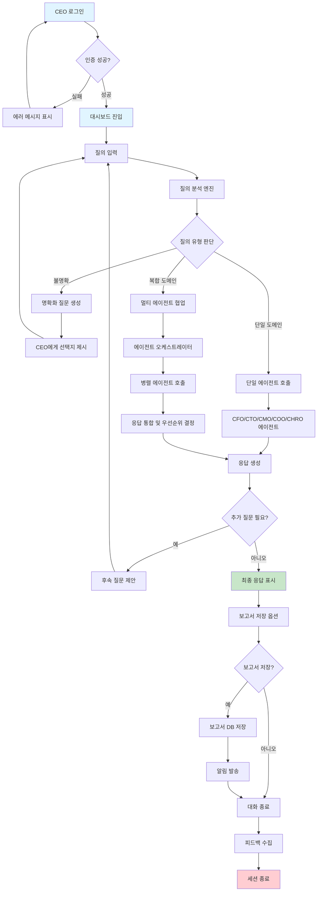
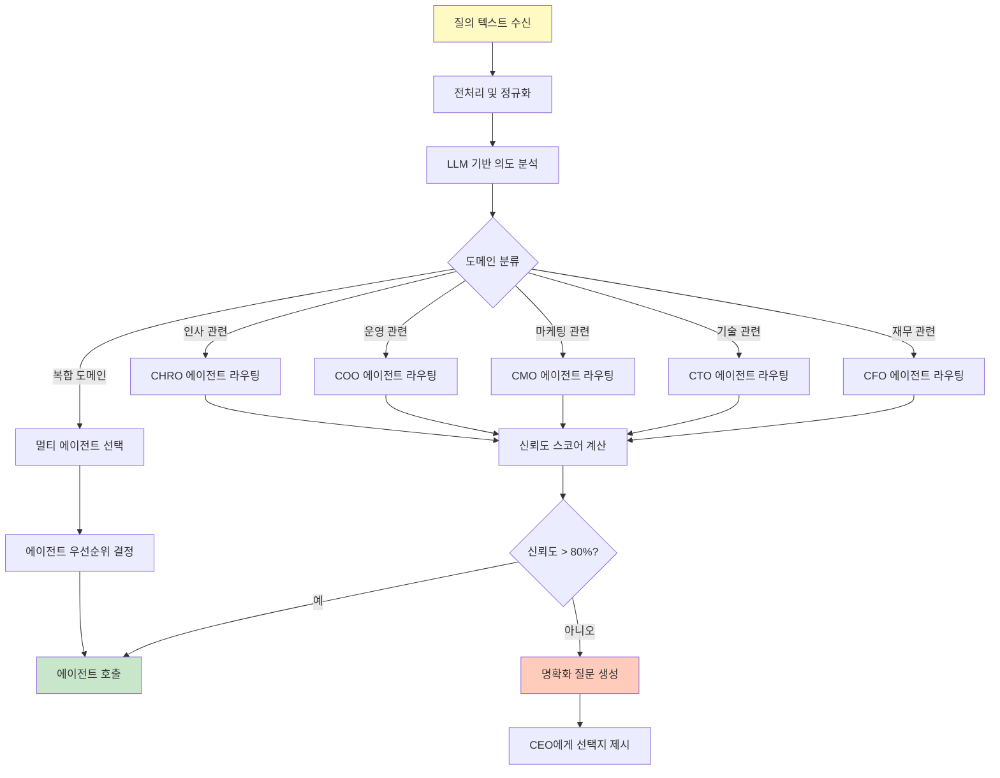
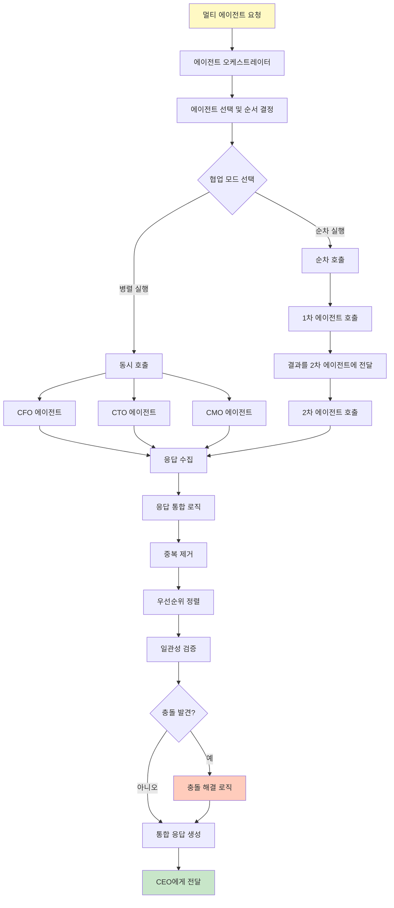
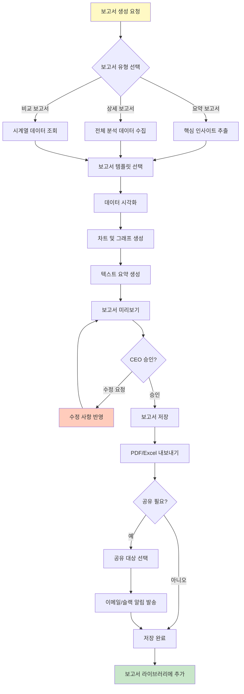
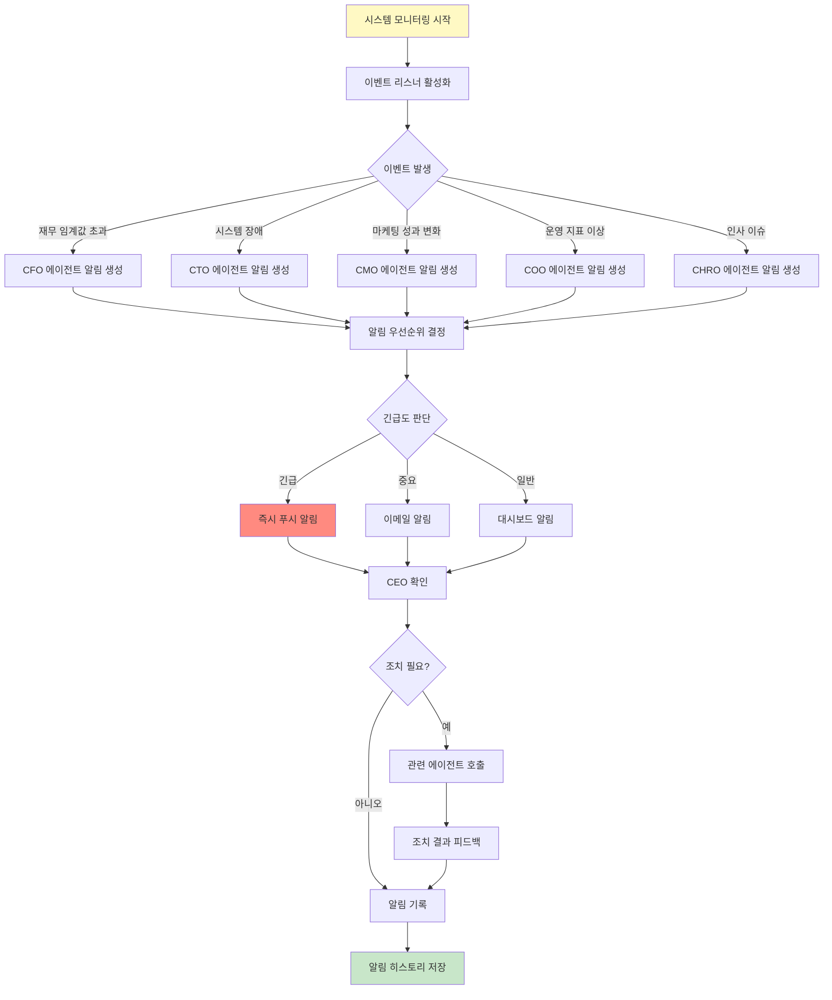
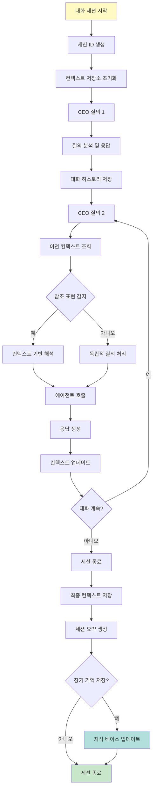
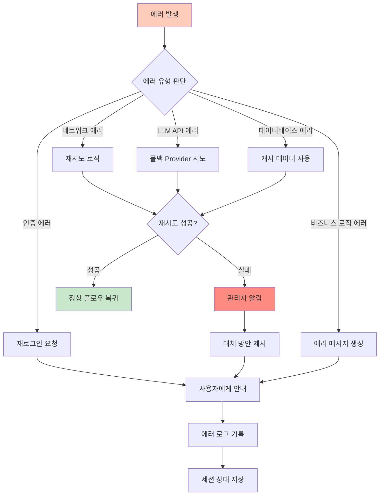

# User Flow (사용자 흐름도)
## C-Level AI Agent Service - User Journey Visualization

**버전**: v1.0  
**작성일**: 2026-01-10  
**프로젝트**: CEO를 위한 맞춤형 AI 에이전트 서비스

---

## 1. 전체 사용자 흐름 개요

본 문서는 CEO가 질의를 입력한 시점부터 에이전트가 응답을 제공하기까지의 전체 여정을 시각화합니다. 각 흐름은 PRD의 사용자 스토리와 연결되어 있습니다.

---

## 2. 핵심 사용자 흐름

### 2.1 메인 플로우: CEO 질의 → 에이전트 응답

### 2.2 세부 플로우 1: 질의 분석 및 라우팅 (FEAT-1)

### 2.3 세부 플로우 2: 멀티 에이전트 협업 (FEAT-2)

### 2.4 세부 플로우 3: 보고서 생성 및 저장 (FEAT-3)

### 2.5 세부 플로우 4: 실시간 알림 및 모니터링 (FEAT-4)

### 2.6 세부 플로우 5: 대화 컨텍스트 유지 (FEAT-5)

---

## 3. 에러 처리 플로우

### 3.1 에러 처리 및 복구

---

## 4. 사용자 여정 매핑

### 4.1 CEO의 일일 사용 시나리오

```mermaid
graph LR
    A[오전 9시: 로그인] --> B[대시보드 확인]
    B --> C[전날 주요 지표 리뷰]
    C --> D[CFO에게 재무 현황 질의]
    
    D --> E[오전 11시: 마케팅 회의 준비]
    E --> F[CMO에게 캠페인 성과 질의]
    
    F --> G[오후 2시: 기술 검토]
    G --> H[CTO에게 개발 진행 상황 질의]
    
    H --> I[오후 4시: 운영 점검]
    I --> J[COO에게 프로세스 효율성 질의]
    
    J --> K[오후 5시: 인사 이슈 확인]
    K --> L[CHRO에게 채용 현황 질의]
    
    L --> M[오후 6시: 일일 보고서 생성]
    M --> N[보고서 검토 및 저장]
    N --> O[로그아웃]
    
    style A fill:#e1f5ff
    style O fill:#ffcdd2
```

---

## 5. 플로우 연결 매트릭스

| 플로우 | PRD 사용자 스토리 | TRD 컴포넌트 | Database 엔티티 |
|--------|-------------------|--------------|-----------------|
| 메인 플로우 | US-1, US-2, US-3 | Query Analysis Engine, Agent Orchestration | Users, Conversations, Messages |
| 질의 분석 및 라우팅 | US-1 | Query Analysis Engine | Messages, Agents |
| 멀티 에이전트 협업 | US-2 | Agent Orchestration Layer | Conversations, Agent_Collaborations |
| 보고서 생성 | US-3 | Report Generator | Reports, Report_Templates |
| 실시간 알림 | US-4 | Notification Service | Notifications, Alert_Rules |
| 컨텍스트 유지 | US-5 | Context Manager | Conversations, Context_Store |

---

## 6. 성공 지표와 플로우 연결

| 플로우 단계 | 측정 지표 | 목표값 |
|-------------|-----------|--------|
| 질의 입력 → 분석 완료 | 분석 시간 | < 1초 |
| 에이전트 호출 → 응답 생성 | 응답 시간 | < 3초 (단일), < 8초 (멀티) |
| 보고서 생성 요청 → 완료 | 생성 시간 | < 10초 |
| 에러 발생 → 복구 | 복구 성공률 | > 95% |
| 대화 세션 전체 | 사용자 만족도 | > 4.5/5.0 |

---

**문서 버전 관리**  
- v1.0 (2026-01-10): 초기 작성, 5개 핵심 플로우 정의
- 다음 업데이트: 사용자 피드백 반영 및 실제 사용 패턴 분석 후 최적화